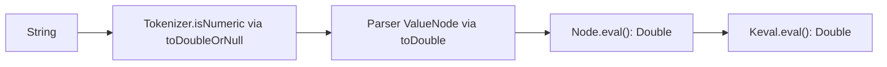
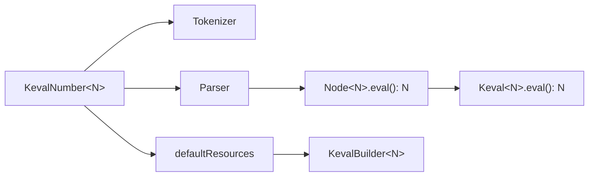

# Generic Number Type Support for Keval

## Current State

The entire pipeline is hardcoded to `Double`:



Every layer in [`src/commonMain/kotlin/com/notkamui/keval/`](src/commonMain/kotlin/com/notkamui/keval/) uses `(Double, Double) -> Double`, `DoubleArray`, and `kotlin.math` — there is no platform-specific code today.

## Target Architecture

Introduce a **typeclass** that owns parsing rules and default resources for a numeric type `N`, then parameterize the full pipeline on `N`.



### New core abstraction: `KevalNumber<N>`

Add [`KevalNumber.kt`](src/commonMain/kotlin/com/notkamui/keval/KevalNumber.kt):

```kotlin
interface KevalNumber<N> {
    fun isValidLiteral(token: String): Boolean
    fun parseLiteral(token: String): N
    fun defaultResources(): Map<String, KevalOperator<N>>
}
```

- **Parsing** moves out of `toDoubleOrNull()` / `toDouble()` into the typeclass.
- **Default resources** move out of `KevalBuilder.DEFAULT_RESOURCES` into each implementation (Double keeps today's full set; BigDecimal gets a **minimal** arithmetic-focused subset — see below).

Consumers can implement `KevalNumber` for any type (`Int`, a custom decimal, etc.) by supplying parsing + whatever defaults they want.

---

## Breaking API Changes (v2.0.0)

| Before (v1.x) | After (v2.x) |
|---|---|
| `class Keval` | `class Keval<N>(private val number: KevalNumber<N>, ...)` |
| `(Double, Double) -> Double` operators | `(N, N) -> N` |
| `(DoubleArray) -> Double` functions | `(List<N>) -> N` |
| `KevalBuilder()` with static `DEFAULT_RESOURCES` | `KevalBuilder(number: KevalNumber<N>)` |
| `String.keval(): Double` | kept as convenience, delegates to `KevalNumbers.Double` |
| `Keval.create { includeDefault() }` | `Keval.create(KevalNumbers.Double) { includeDefault() }` |

### Convenience entry points (preserve ergonomics for Double)

```kotlin
object KevalNumbers {
    val Double: KevalNumber<Double> = KevalNumberDouble
}

// unchanged call sites for the common case
fun String.keval(): Double = KevalNumbers.Double.eval(this)
fun String.keval(generator: KevalBuilder<Double>.() -> Unit): Double =
    Keval.create(KevalNumbers.Double, generator).eval(this)

// JVM + Android BigDecimal (java.math.BigDecimal on both platforms)
val KevalNumbers.BigDecimal: KevalNumber<java.math.BigDecimal>
```

`Keval.eval(expr)` companion shortcut stays as `@JvmStatic` Double-only sugar.

---

## File-by-File Refactor

### 1. Generic operator / AST types — [`AbstractSyntaxTree.kt`](src/commonMain/kotlin/com/notkamui/keval/AbstractSyntaxTree.kt)

Parameterize all internal types on `N`:

- `KevalBinaryOperator<N>(..., implementation: (N, N) -> N)`
- `KevalUnaryOperator<N>(..., implementation: (N) -> N)`
- `KevalFunction<N>(..., implementation: (List<N>) -> N)`
- `KevalConstant<N>(value: N)`
- `Node<N>` with `fun eval(): N`
- `FunctionNode` collects `children.map { it.eval() }` as `List<N>` (not `DoubleArray`)

`KevalOperator` becomes `KevalOperator<N>` sealed interface.

### 2. Parser — [`Grammar.kt`](src/commonMain/kotlin/com/notkamui/keval/Grammar.kt)

- `Parser<N>` takes `KevalNumber<N>` alongside operators map.
- Replace `String.isDouble()` / `token.toDouble()` with `number.isValidLiteral(token)` / `number.parseLiteral(token)`.
- `String.toAST(number: KevalNumber<N>, operators: Map<String, KevalOperator<N>>): Node<N>`.

### 3. Tokenizer — [`Tokenizer.kt`](src/commonMain/kotlin/com/notkamui/keval/Tokenizer.kt)

- `String.isNumeric(number: KevalNumber<N>)` delegates to `number.isValidLiteral(this)`.
- `normalizeTokens` / `tokenize` accept `KevalNumber<N>` (threaded from `toAST`).
- Extend `TOKENIZER_REGEX` to support scientific notation (`1.23e4`, `1e-10`) — needed for BigDecimal literals and improves Double parsing. Keep backward-compatible plain integer/decimal forms.

### 4. Builder — [`KevalBuilder.kt`](src/commonMain/kotlin/com/notkamui/keval/KevalBuilder.kt)

- `class KevalBuilder<N>(private val number: KevalNumber<N>, baseResources: ... = emptyMap())`
- `includeDefault()` → `resources += number.defaultResources()`
- All builder `implementation` fields become `(N, N) -> N`, `(N) -> N`, `(List<N>) -> N`.
- `build(): Keval<N>`
- **Delete** the 100+ line `DEFAULT_RESOURCES` companion — it moves to `KevalNumberDouble`.

### 5. Public API — [`Keval.kt`](src/commonMain/kotlin/com/notkamui/keval/Keval.kt)

- `class Keval<N> internal constructor(private val number: KevalNumber<N>, private val resources: ...)`
- All `with*` methods take generic lambdas; return `Keval<N>`.
- `eval(mathExpression: String): N` calls `mathExpression.toAST(number, resourcesView()).eval()`.
- `companion object.create(number: KevalNumber<N>, generator: KevalBuilder<N>.() -> Unit): Keval<N>`

### 6. Double implementation — new [`KevalNumberDouble.kt`](src/commonMain/kotlin/com/notkamui/keval/KevalNumberDouble.kt)

Move today's [`KevalBuilder.DEFAULT_RESOURCES`](src/commonMain/kotlin/com/notkamui/keval/KevalBuilder.kt) verbatim into `KevalNumberDouble.defaultResources()`, adapting signatures to `(N, N) -> N` / `List<N>`.

Parsing: `isValidLiteral` → `toDoubleOrNull() != null`; `parseLiteral` → `toDouble()`.

Extract shared boolean helpers (`doubleToBoolean`, `reduceBoolean`, etc.) as private functions in this file.

---

## JVM / Android BigDecimal Support

No external dependencies — only `java.math.BigDecimal` and `MathContext`, available on both JVM and Android.

### Platform availability

| Target | BigDecimal API | Notes |
|---|---|---|
| JVM | Yes | via `jvmAndAndroidMain` |
| Android | Yes | via `jvmAndAndroidMain` (same implementation) |
| JS / Native (iOS, etc.) | No | `KevalNumbers.Double` only; types not compiled in |

**Why not `jvmMain` alone?** In KMP, `jvmMain` is compiled only into the JVM artifact. Android uses a separate `androidMain` source set — code in `jvmMain` is invisible to Android consumers even though `java.math.BigDecimal` exists on Android.

### New targets and source sets in [`build.gradle.kts`](build.gradle.kts)

```kotlin
kotlin {
    jvm()
    androidTarget()  // new

    // ... existing js/native targets ...

    sourceSets {
        val jvmAndAndroidMain by creating {
            dependsOn(commonMain.get())
        }
        jvmMain.get().dependsOn(jvmAndAndroidMain)
        androidMain.get().dependsOn(jvmAndAndroidMain)

        val jvmAndAndroidTest by creating {
            dependsOn(commonTest.get())
        }
        jvmTest.get().dependsOn(jvmAndAndroidTest)
        androidUnitTest.get().dependsOn(jvmAndAndroidTest)
    }
}
```

BigDecimal implementation lives in `jvmAndAndroidMain` — compiled into both JVM and Android publications. No extra dependencies.

### New file — [`src/jvmAndAndroidMain/kotlin/com/notkamui/keval/KevalNumberBigDecimal.kt`](src/jvmAndAndroidMain/kotlin/com/notkamui/keval/KevalNumberBigDecimal.kt)

```kotlin
object KevalNumberBigDecimal : KevalNumber<BigDecimal> {
    val mathContext: MathContext = MathContext.DECIMAL128

    override fun isValidLiteral(token: String): Boolean = ...
    override fun parseLiteral(token: String): BigDecimal = ...
    override fun defaultResources(): Map<String, KevalOperator<BigDecimal>> = ...
}
```

**Included in BigDecimal defaults** (native `BigDecimal` / `compareTo` / `RoundingMode` only):

| Category | Operators / functions |
|---|---|
| Binary | `+`, `-`, `*`, `/`, `%`, `^` (integer exponent via `pow(int)` only) |
| Unary | `-` (negate), `+` (identity) |
| Functions | `neg`, `abs`, `sign`, `min`, `max`, `sum`, `avg`, `ceil`, `floor`, `round`, `trunc` |
| Comparison / logical | `bool`, `not`, `and`, `nand`, `or`, `nor`, `xor`, `xnor`, `imply`, `nimply`, `eq`, `ne`, `gt`, `lt`, `ge`, `le` |
| Constants | none (consumers can add `PI` / `e` via `withConstant` or a custom `KevalNumber` wrapper) |

Implementation notes:
- Div-by-zero: `compareTo(ZERO) == 0` → `KevalZeroDivisionException`
- Truthiness: `compareTo(ZERO) != 0`
- `^` with non-integer exponent: throw `KevalInvalidArgumentException` (no approximation library)
- `avg`: `sum / size` using configured `MathContext`
- Rounding ops: `setScale` / `RoundingMode`

**Explicitly excluded** (require transcendental math or heavy custom code — users add via `KevalBuilder` if needed):

- Trig: `sin`, `cos`, `tan`, `asin`, `acos`, `atan`
- Roots / powers: `sqrt`, `cbrt`, `nthrt`, fractional `^`
- Logs / exp: `exp`, `ln`, `log10`, `log2`
- Random: `rand`, `randRange`
- Other: `!` (factorial), `median`, `percentile`, constants `PI` / `e`

Expose via `KevalNumbers.BigDecimal` in the same `jvmAndAndroidMain` file (or a small `KevalNumbers.jvmAndAndroid.kt`).

### JVM / Android convenience extensions

```kotlin
fun String.kevalBigDecimal(
    generator: KevalBuilder<BigDecimal>.() -> Unit = { includeDefault() }
): BigDecimal = Keval.create(KevalNumberBigDecimal, generator).eval(this)
```

---

## Tests

Update all tests in [`src/commonTest/`](src/commonTest/kotlin/com/notkamui/keval/) to use `KevalNumbers.Double` / `Keval.create(KevalNumbers.Double)`.

Add [`src/jvmAndAndroidTest/kotlin/com/notkamui/keval/KevalBigDecimalTest.kt`](src/jvmAndAndroidTest/kotlin/com/notkamui/keval/KevalBigDecimalTest.kt) (runs on both JVM and Android unit tests):

- Precision cases that fail with Double (e.g. `0.1 + 0.2`).
- Smoke test each included default category (arithmetic, comparison, logical, aggregates, rounding).
- Div-by-zero, non-integer `^`, and invalid-argument paths.
- Confirm excluded functions (e.g. `sin`) are **not** in defaults but can be added via builder.

Existing Double tests should remain green with minimal assertion changes (same expected values).

---

## Versioning and Docs

- Bump version to **2.0.0** in [`build.gradle.kts`](build.gradle.kts).
- Update [`README.md`](README.md) with:
  - Generic API section (`KevalNumber`, `Keval.create(number) { ... }`).
  - JVM/Android BigDecimal section with `KevalNumbers.BigDecimal` / `kevalBigDecimal()`, documenting the **reduced** default set vs Double and which platforms support it.
  - Migration guide from v1.x (type signature changes, `KevalBuilder` now requires a number context).

---

## Design Notes / Non-Goals

- **JS / Native targets** remain Double-only; BigDecimal types are not compiled into those artifacts.
- **Android**: added as a new publish target; shares BigDecimal code with JVM via `jvmAndAndroidMain`.
- **`MathContext` configurability**: ship with `DECIMAL128` default; a follow-up could add `KevalNumberBigDecimal.withContext(MathContext)` if consumers need per-evaluation precision control.
- **BigDecimal transcendental functions**: intentionally out of scope for built-in defaults; consumers can register custom functions via `KevalBuilder` (possibly wrapping a third-party decimal math lib themselves).
- **Custom numeric types**: fully supported — implement `KevalNumber<MyType>` and pass it to `Keval.create`; only parsing + defaults need type-specific logic; tokenizer/parser/AST are generic.
